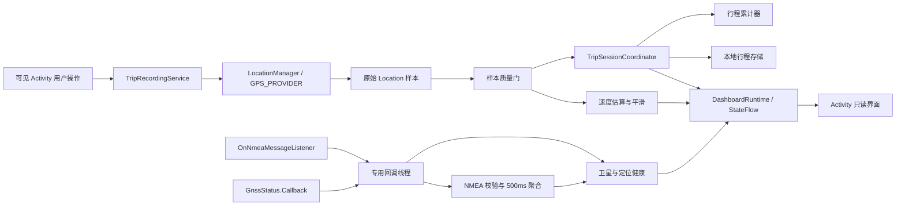

# CarGPS Android 技术设计

作者：long

验证日期：2026-08-07

最低运行环境：Android 8.1 / API 27

构建目标：compileSdk / targetSdk 36

## 1. 技术边界

采用原生 Android 多模块工程，以 Kotlin 和 Jetpack Compose 实现竖屏手机仪表。拆分时保留系统 `LocationManager` 定位路径和离线能力，不依赖 Fused Location Provider，也不把网络作为定位或界面的前置条件。

手机版保留 `minSdk = 27`，构建目标独立升级到 API 36。构建链采用 AGP 8.13.2、Gradle 8.13、Kotlin/Compose Compiler 2.3.21、Compose BOM 2026.06.00；运行路径仍不能把 API 30 才加入的重载直接调用在 API 27 上。

## 2. 数据流

关键原则：只有“有效定位样本”能驱动行程累计；NMEA 和卫星回调补充诊断信息，但不能绕过质量门直接修改里程。

## 3. API 27 实现方式

- 位置更新：`LocationManager.requestLocationUpdates(LocationManager.GPS_PROVIDER, ...)`。
- NMEA：使用 API 24 已提供的 `addNmeaListener(OnNmeaMessageListener, Handler)`，不要使用 API 30 才加入的 `Executor` 重载。
- 卫星状态：使用 `registerGnssStatusCallback(GnssStatus.Callback, Handler)`，不要继续使用 API 24 已废弃的 `GpsStatus.Listener`。
- 回调线程：位置、NMEA 和卫星回调注册到专用 `HandlerThread`；NMEA 校验与卫星遍历不占用主线程，聚合结果再回到主线程更新状态。
- 权限：NMEA、GNSS 详细状态及可靠的速度/里程记录需要 `android.permission.ACCESS_FINE_LOCATION`。`TripAccessPolicy` 区分仅近似、首次/永久拒绝、系统定位关闭和 Android 13+ 通知拒绝；阻断时提供对应请求或设置入口，不能笼统显示“未授权”或误报“正在记录”。
- 数据字段：在读取速度、海拔、方向和精度前分别检查 `hasSpeed()`、`hasAltitude()`、`hasBearing()` 和 `hasAccuracy()`，缺失值保持为空。

## 4. 数据优先级

| 指标 | 主来源 | 备用/诊断来源 | 说明 |
| --- | --- | --- | --- |
| 坐标 | `Location` | GGA/RMC | 所有统计只认通过质量门的 `Location` |
| 瞬时速度 | `Location.getSpeed()` | 相邻点推导、RMC/VTG | RMC/VTG 用于诊断差异，不独立累计 |
| 海拔 | `Location.getAltitude()` | GGA | 海拔缺失时不显示 `0 m` |
| 航向 | `Location.getBearing()` | RMC/VTG | 低速时航向可能不稳定 |
| 时间 | `Location.getTime()` | RMC/ZDA | 界面转换为本地时区，原始值保留 UTC 语义 |
| 卫星 | `GnssStatus` | GSA/GSV | 分开显示可见数和参与定位数 |
| 精度因子 | NMEA GSA/GGA | 无 | 设备未输出时显示“未提供” |

## 5. 工程与模块边界

- `gps-core`：注册和注销系统位置、NMEA、GNSS 状态监听，并承载质量门、速度估算和行程统计；不包含手机界面。
- `mobile-app`：包名 `com.cargps.mobile`；`CarGpsApplication` 持有进程内单例 `DashboardRuntime`，`TripRecordingService` 唯一持有 `LocationEngine`，Activity 只负责竖屏界面、权限入口、服务绑定和用户命令。
- `nmea-parser`：位于 `gps-core`，处理校验和、字段解析和语句容错，不维护行程状态。
- `location-quality`：位于 `gps-core`，判断样本是否可显示、是否可累计、是否发生过期或断点。
- `speed-estimator`：位于 `gps-core`，处理速度来源选择、单位转换、异常值过滤和平滑。
- `trip-domain`：位于 `gps-core`，`TripAccumulator` 以 O(1) 单点更新处理距离、移动时间和最高速度，只保留最后一个点与累计值。
- `trip-session`：`TripSessionCoordinator` 是进程内唯一行程会话所有者，串行处理领域命令；界面只观察“加载中、处理中、已确认、失败”状态。
- `trip-storage`：活动行程快照、已结束行程与轨迹点的本地持久化。
- `dashboard-ui`：手机界面只消费 `gps-core` 提供的只读仪表状态，不自行计算业务统计。

业务规则应写在对应模块实现附近。例如，“定位恢复后不连接失锁前后的两个点”应贴近行程累计器的断点处理代码，而不是只保留在类头说明中。代码注释作者统一为 `long`，关键注释说明业务原因和错误结果，不复述语句动作。

## 6. 前后台策略

- `TripRecordingService` 是唯一定位会话所有者。界面可见且未开始行程时，Activity 绑定服务以获取定位；活动行程开始后，Service 在 Activity 不可见或锁屏时继续持有 `LocationEngine`。
- 用户只能在可见 Activity 内明确开始行程并调用 `startForegroundService()`，符合 Android 12 / API 31 起的后台启动限制；当前不支持任意后台时刻新建定位服务。
- Service 使用常驻低优先级通知，提供返回应用和结束行程的显式不可变 `PendingIntent`；通知按模式、每 10 米或最多每 5 秒刷新，避免每秒重建 SystemUI 视图。
- Manifest 已声明 `FOREGROUND_SERVICE`、`FOREGROUND_SERVICE_LOCATION` 和 `android:foregroundServiceType="location"`；Activity 与 Service 在启动、恢复和系统状态变化时使用统一 `TripAccessState` 检查精确位置、GPS Provider 和 API 33+ 通知权限。
- API 27 不需要 `ACCESS_BACKGROUND_LOCATION`，该权限从 API 29 才出现。当前 M2 不申请后台位置；只有未来确需从后台创建定位服务时才单独评审该权限和系统豁免。
- M2 核心实现及 Pixel_9 / API 35 短路径已验证，但 API 27/API 29、连续锁屏 30 分钟和真实道路长测未完成，因此尚不能把跨版本后台记录标记为已正式交付。
- 系统以 `START_STICKY` 重建 Service 时先升为“正在确认行程存储”前台状态，并等待 `DashboardRuntime.awaitInitialRestore()`；只有恢复完成且存在活动行程时才重启定位，没有活动行程或恢复失败后才停止 Service。
- 权限请求历史只用于区分首次请求与后续拒绝；Activity 在权限回调、设置返回、`onResume()` 和 Provider 广播后重新读取系统状态。设置返回不自动开始行程，活动行程受阻时停止定位并保留用户结束行程的入口。

## 7. 持久化实现

- 生产装配使用 Room 2.8.4 管理本地 SQLite，schema 当前为 v4；`TripStorage` 隔离数据库实现，领域与 UI 不依赖 Room 类型。`SqliteTripStorage` 只保留为旧 schema fixture 构造和兼容性验证工具。
- Room 注册显式 `1 -> 2`、`2 -> 3`、`3 -> 4` 迁移并导出 v4 schema，不启用 destructive fallback。v4 规范化旧表以建立 Room schema identity，但不改变统计口径或历史数据。
- 数据库写入统一进入单线程后台队列；`TripSessionCoordinator` 串行派发恢复、历史查询和元数据确认，阻塞式存储调用切到 `Dispatchers.IO`，定位点由存储队列在后台批量落库。读取屏障只观察它之前已经入队的写入。
- 有效点按最多 16 点或 1 秒组成批次，在单个事务中写入；暂停、结束、读取、已执行的生命周期检查点和正常关闭前强制冲刷尾批次。`onTaskRemoved()` 只异步请求检查点，系统可能在请求完成前直接回收进程，异常退出仍存在最多约 1 秒的未确认点窗口。
- `ActiveTripCheckpoint` 表达数据库确认边界：行程开始时间、确认点数、最后 `sequence` 和最后点时间。队列每次批量事务成功后发布该检查点，`TripSessionCoordinator` 将其映射到 `DashboardRuntime`；未冲刷点只能更新实时统计，不能进入确认边界。
- 活动行程元数据在开始、暂停和恢复时排队写入；协调器等待写入屏障成功后才发布新模式。历史列表使用结束时间索引。
- `ActiveTripLoadResult` 显式区分 `Empty`、`Loaded` 和 `Corrupt`。无法识别活动行程 mode 时保留原始行，协调器关闭存储门禁并拒绝开始新行程；迁移失败依赖事务回滚保留原数据库，禁止自动清库。
- 结束行程在同一事务中先写入已结束统计并迁移活动轨迹点，再清除活动行程；中途失败时优先保留完整可恢复数据。
- 进程重建时由协调器恢复行程模式、开始时间、暂停累计、已落库轨迹和最后确认检查点，并主动断开恢复前后的定位点，避免补算跨进程位移。
- 原始 NMEA 默认不持久化；后续导出能力与轨迹历史继续使用独立存储边界。

## 8. 测试重点

- NMEA：合法校验和、错误校验和、缺字段、多星座 talker ID、未知语句、非数值字段。
- 质量门：时间倒退、重复时间、低精度、超时恢复、跳点、静止漂移。
- 统计：移动/停车边界、暂停、恢复、结束、进程重建和零时长除法。
- 长行程：十万点增量统计不溢出，`DashboardRuntime` 不持有完整轨迹；Room 千点批量写入后顺序与恢复一致。
- UI：无权限、仅近似、永久拒绝、系统定位关闭、通知拒绝、无数据、缺海拔、弱定位、过期、超长坐标文本，以及 `Pixel_9` 竖屏安全区和单屏无滚动约束。
- 服务：Manifest 私有性、`location` 类型、权限声明、显式 Intent 和不可变 `PendingIntent`；运行时覆盖 Home、锁屏、Activity 重建、通知结束与单定位线程。
- 恢复：用应用自身 UID 向活动行程进程发送 `SIGKILL`，验证系统以 null Intent 重建 `START_STICKY` Service、等待存储、恢复前台通知和单定位线程；`force-stop` 单独建模，不算普通恢复。
- 性能：Baseline Profile 覆盖首屏；Macrobenchmark 在 Pixel_9 上记录无预编译冷启动 TTID，相对比较时保持同一 AVD 配置。M2 重构后生成文件仍含已删除类名，必须重新生成后才能作为当前性能资产。
- 设备：安装、UI 和功能验证显式指定 `Pixel_9`，不操作 Redmi 真机；任何安装命令都不能依赖 adb 默认设备。

## 9. 已验证的官方依据

- [`OnNmeaMessageListener`](https://developer.android.com/reference/android/location/OnNmeaMessageListener)：API 24 加入，用于接收 GNSS NMEA 语句。
- [`LocationManager`](https://developer.android.com/reference/android/location/LocationManager)：位置 API 权限、NMEA 监听和 GNSS 状态回调定义。
- [`Location`](https://developer.android.com/reference/android/location/Location)：位置对象包含坐标、时间、精度，以及可选的方向、海拔和速度。
- [运行时位置权限](https://developer.android.com/develop/sensors-and-location/location/permissions/runtime)：Android 12+ 允许用户只授予近似位置；精确升级应再次共同请求 `ACCESS_COARSE_LOCATION` 与 `ACCESS_FINE_LOCATION`，并根据两项授权结果区分精度。
- [后台定位](https://developer.android.com/develop/sensors-and-location/location/background)：Android 8.0 及以上后台应用的位置更新会被限制为每小时少量次数。
- [Android 14 前台服务类型](https://developer.android.com/about/versions/14/changes/fgs-types-required)：定位服务需声明 `location` 类型和 `FOREGROUND_SERVICE_LOCATION`，并在启动前满足位置权限条件。
- [启动前台服务](https://developer.android.com/develop/background-work/services/fgs/launch)：Android 12 起限制后台启动；Android 14 起会核验服务类型对应权限。

定位基础 API 依据于 2026-08-05 核验，近似位置升级和前台服务规则于 2026-08-07 重新抓取 Android Developers 正文确认。不同手机 GNSS 驱动是否实际输出全部 NMEA 语句，仍需在目标设备上验证。

## 10. 后续迁移边界

剩余工作不能按“权限补丁”或“升版本”孤立推进。前台服务已经改变定位会话所有权，Room 已经改变写入确认和进程恢复语义；M5 权限状态机的设备验收与 M6 事件串行化仍会影响服务能否启动及尾点能否可靠落库。完整优先级、依赖关系和验收门槛见 [剩余高风险迁移项](./migration-risks.md)。

M1 已建立可确认的行程状态，M2 已把定位所有权迁入前台服务，M3 已建立最后确认检查点和 `START_STICKY` 恢复门禁，M4 已完成 Room schema v4、旧版本显式迁移和损坏状态护栏。M5 权限状态机已在工作树实现，并通过本地关卡与 Pixel_9 / API 35 系统权限矩阵；下一步推进 M6 单一事件队列、跨 API 长测并刷新 M7 Baseline Profile。M5 的 API 27/29/31/33 矩阵、真实设备 2 小时长测和 M8 AGP 9 分阶段推进。
