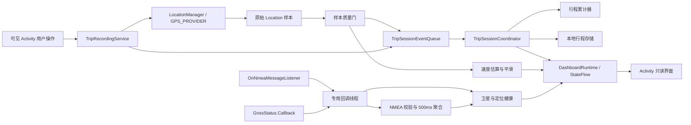

# CarGPS Android 技术设计

作者：long

验证日期：2026-08-08

最低运行环境：Android 8.1 / API 27

构建目标：compileSdk / targetSdk 36

## 1. 技术边界

采用原生 Android 多模块工程，以 Kotlin 和 Jetpack Compose 实现竖屏手机仪表。拆分时保留系统 `LocationManager` 定位路径和离线能力，不依赖 Fused Location Provider，也不把网络作为定位或界面的前置条件。

手机版保留 `minSdk = 27`，构建目标独立升级到 API 36。构建链采用 AGP 8.13.2、Gradle 8.13、Kotlin/Compose Compiler 2.3.21、Compose BOM 2026.06.00；运行路径仍不能把 API 30 才加入的重载直接调用在 API 27 上。

## 2. 数据流

关键原则：只有“有效定位样本”能驱动行程累计；NMEA 和卫星回调补充诊断信息，但不能绕过质量门直接修改里程。

## 3. API 27 实现方式

- 位置更新：`LocationManager.requestLocationUpdates(LocationManager.GPS_PROVIDER, ...)`。
- NMEA：使用 API 24 已提供的 `addNmeaListener(OnNmeaMessageListener, Handler)`，不要使用 API 30 才加入的 `Executor` 重载。
- 卫星状态：使用 `registerGnssStatusCallback(GnssStatus.Callback, Handler)`，不要继续使用 API 24 已废弃的 `GpsStatus.Listener`。
- 回调线程：位置、NMEA 和卫星回调注册到专用 `HandlerThread`；NMEA 校验与卫星遍历不占用主线程，聚合结果再回到主线程更新状态。
- 权限：NMEA、GNSS 详细状态及可靠的速度/里程记录需要 `android.permission.ACCESS_FINE_LOCATION`。`TripAccessPolicy` 区分仅近似、首次/永久拒绝、系统定位关闭和 Android 13+ 通知拒绝；阻断时提供对应请求或设置入口，不能笼统显示“未授权”或误报“正在记录”。
- 数据字段：在读取速度、海拔、方向和精度前分别检查 `hasSpeed()`、`hasAltitude()`、`hasBearing()` 和 `hasAccuracy()`，缺失值保持为空。

## 4. 数据优先级

| 指标 | 主来源 | 备用/诊断来源 | 说明 |
| --- | --- | --- | --- |
| 坐标 | `Location` | GGA/RMC | 所有统计只认通过质量门的 `Location` |
| 瞬时速度 | `Location.getSpeed()` | 相邻点推导、RMC/VTG | RMC/VTG 用于诊断差异，不独立累计 |
| 海拔 | `Location.getAltitude()` | GGA | 海拔缺失时不显示 `0 m` |
| 航向 | `Location.getBearing()` | RMC/VTG | 低速时航向可能不稳定 |
| 时间 | `Location.getTime()` | RMC/ZDA | 界面转换为本地时区，原始值保留 UTC 语义 |
| 卫星 | `GnssStatus` | GSA/GSV | 分开显示可见数和参与定位数 |
| 精度因子 | NMEA GSA/GGA | 无 | 设备未输出时显示“未提供” |

## 5. 工程与模块边界

- `gps-core`：注册和注销系统位置、NMEA、GNSS 状态监听，并承载质量门、速度估算和行程统计；不包含手机界面。
- `mobile-app`：包名 `com.cargps.mobile`；`CarGpsApplication` 持有进程内单例 `DashboardRuntime`，`TripRecordingService` 唯一持有 `LocationEngine`，Activity 只负责竖屏界面、权限入口、服务绑定和用户命令。Service 内的 `LocationEngineSessionController` 统一接收可见性、会话阶段、权限/Provider 与存储故障信号，负责幂等地 reconcile 启停动作；控制器只缓存已成功执行的动作，底层 `LocationEngine.start()` 失败时不缓存，允许后续生命周期事件重试。
- `nmea-parser`：位于 `gps-core`，处理校验和、字段解析和语句容错，不维护行程状态。
- `location-quality`：位于 `gps-core`，判断样本是否可显示、是否可累计、是否发生过期或断点。
- `speed-estimator`：位于 `gps-core`，处理速度来源选择、单位转换、异常值过滤和平滑。
- `trip-domain`：位于 `gps-core`，`TripAccumulator` 以 O(1) 单点更新处理距离、移动时间和最高速度，只保留最后一个点与累计值。
- `trip-session`：`TripSessionEventQueue` 是进程内唯一事件入口，固定先恢复并按入队顺序交付领域命令；关闭或 actor 异常会失败等待者并停止接收。未预期终止由 `DashboardRuntime` 映射为可见的“恢复中/终态失败”状态：先停止定位输入并断开定位段，每个 Runtime 生命周期最多自动重建一次队列，新 actor 必须先 Restore 同一协调器的已确认存储状态；第二次异常不再循环重建。Start 等用户命令采用 `SKIP_IF_NOT_STARTED`，调用方取消后跳过尚未开始的副作用；任务移除等生命周期 Checkpoint 采用 `KEEP_QUEUED`，等待方取消后仍由应用级 Runtime actor 继续冲刷。`TripSessionCoordinator` 是唯一行程会话所有者，负责存储确认和状态转换。界面只观察“加载中、处理中、恢复中、已确认、失败”状态。
- `trip-storage`：活动行程快照、已结束行程与轨迹点的本地持久化。
- `dashboard-ui`：手机界面只消费 `gps-core` 提供的只读仪表状态，不自行计算业务统计。

业务规则应写在对应模块实现附近。例如，“定位恢复后不连接失锁前后的两个点”应贴近行程累计器的断点处理代码，而不是只保留在类头说明中。代码注释作者统一为 `long`，关键注释说明业务原因和错误结果，不复述语句动作。

## 6. 前后台策略

- `TripRecordingService` 是唯一定位会话所有者。界面可见且未开始行程时，Activity 绑定服务以获取定位；活动行程开始后，Service 在 Activity 不可见或锁屏时继续持有 `LocationEngine`。
- 用户只能在可见 Activity 内明确开始行程并调用 `startForegroundService()`，符合 Android 12 / API 31 起的后台启动限制；当前不支持任意后台时刻新建定位服务。
- Service 使用常驻低优先级通知，提供返回应用和结束行程的显式不可变 `PendingIntent`；行程模式或存储阻断状态变化时立即刷新，稳定状态下按每 10 米或最多每 5 秒刷新，避免每秒重建 SystemUI 视图。
- Manifest 已声明 `FOREGROUND_SERVICE`、`FOREGROUND_SERVICE_LOCATION` 和 `android:foregroundServiceType="location"`；Activity 与 Service 在启动、恢复和系统状态变化时使用统一 `TripAccessState` 检查精确位置、GPS Provider 和 API 33+ 通知权限。
- API 27 不需要 `ACCESS_BACKGROUND_LOCATION`，该权限从 API 29 才出现。当前 M2 不申请后台位置；只有未来确需从后台创建定位服务时才单独评审该权限和系统豁免。
- M2 核心实现及 Pixel_9 / API 35、API 27、API 29、API 31 聚焦短路径已验证；API 31 已补充锁屏保持和活动行程撤权后的受阻结束路径，API 27/API 29 还完成了活动行程覆盖升级后的前台服务恢复。Pixel_9 / API 35、Android 10 / API 29 和 Android 8.1 / API 27 已分别完成 41 个样本、1831/1816/1816 秒的 Home、系统设置、锁屏睡眠和解锁返回回归，期间单进程、前台服务、通知和单定位线程持续，结束后资源清理。API 27 整机重启边界也已验证：活动行程数据保留，但系统不自动启动 Service；用户打开应用后由 Room 恢复并重新建立定位。最新背压、普通持久化失败输入阻断、恢复首点分段、队列取消语义和 actor 单次恢复分支已通过 `gps-core` 58/58、手机版 33/33 JVM、完整本地构建，以及 Pixel_9 / API 35 和 API 27 的完整 `gps-core` 14/14、手机版 14/14 instrumentation；两档设备的 Runtime/Room 背压专项各为 1/1，Service 生命周期 seam 各为 8/8。Service 的所有定位生命周期入口现在经 `LocationEngineSessionController` 统一 reconcile，重复重绑/恢复只执行一次启停，启动异常不会被错误缓存为已启动；真实 Service seam 还验证注入式可恢复写失败、End 前后定位顺序、活动行程 Activity 重建后重绑原 Service，以及 actor 第一次异常单次恢复、第二次异常进入终态不再重建；任务移除 Checkpoint 在 Service 销毁后继续完成。Room/SQLite 存储层又在 API 35/API 27 的实际连接上验证了 `PRAGMA query_only = ON` 导致的永久只读写失败与事务保留；物理低存储量化、真实系统 GPS 注册、Activity/Service 进程同时复杂重建、Checkpoint 完成前整个进程回收和真实道路长测仍未完成。
- 系统以 `START_STICKY` 重建 Service 时先升为“正在确认行程存储”前台状态，并等待 `DashboardRuntime.awaitInitialRestore()`；只有恢复完成且存在活动行程时才重启定位，没有活动行程或恢复失败后才停止 Service。
- 权限请求历史只用于区分首次请求与后续拒绝；Activity 在权限回调、设置返回、`onResume()` 和 Provider 广播后重新读取系统状态。设置返回不自动开始行程，活动行程受阻时停止定位并保留用户结束行程的入口。
- 整机重启不属于当前 `START_STICKY` 恢复承诺：API 27 实测重启后没有手机版进程、Service、通知或 GPS 注册，打开应用后才显示“已恢复”。当前 Manifest 不注册 `BOOT_COMPLETED`，也不申请 `ACCESS_BACKGROUND_LOCATION`；若未来要求开机自动继续，必须先评审后台位置权限、Android 14 while-in-use 规则、Android 15 `BOOT_COMPLETED` 限制和 Play 政策，再决定是否新增 receiver。

## 7. 持久化实现

- 生产装配使用 Room 2.8.4 管理本地 SQLite，schema 当前为 v4；`TripStorage` 隔离数据库实现，领域与 UI 不依赖 Room 类型。`SqliteTripStorage` 只保留为旧 schema fixture 构造和兼容性验证工具。
- Room 注册显式 `1 -> 2`、`2 -> 3`、`3 -> 4` 迁移并导出 v4 schema，不启用 destructive fallback。v4 规范化旧表以建立 Room schema identity，但不改变统计口径或历史数据。
- 数据库写入统一进入单线程后台队列；`TripSessionEventQueue` 固定先恢复，并按 FIFO 串行交付 Start、AppendPoint、Pause、Resume、End、Tick 和 Checkpoint，`TripSessionCoordinator` 负责历史查询和元数据确认。等待型 Start 在确认后同步发布 `DashboardState`；Start 等用户命令的等待方取消后可跳过尚未开始的命令，生命周期 Checkpoint 则保留在队列中。队列关闭或异常会唤醒等待者并拒绝新事件。actor 异常恢复期间 `storageReady=false`、`tripRuntimeRecovering=true`，Service 保持恢复前台状态但停止定位；新 actor 的 Restore 返回后才清除错误并允许重新注册定位，连续第二次异常进入终态。阻塞式存储调用切到 `Dispatchers.IO`，定位点由存储队列在后台批量落库；读取屏障只观察它之前已经入队的写入。
- 有效点按最多 16 点或 1 秒组成批次，在单个事务中写入；暂停、结束、读取、已执行的生命周期检查点和正常关闭前强制冲刷尾批次。队列用原子计数预留未确认点名额，磁盘持续不可写时最多保留 16 点，第 17 个点通过 `TripStorageBackpressureException` 同步拒绝，避免定位回调无限堆积内存。正常情况下批次延迟约 1 秒；异常写失败时只保证未确认点数量上限，不保证时间上限。`TripRecordingService.onTaskRemoved()` 以 `CoroutineStart.UNDISPATCHED` 在回调返回前同步入队 Checkpoint，并使用 `KEEP_QUEUED` 保证 Service 销毁或等待协程取消后仍由 Runtime actor 继续冲刷；若整个进程在完成前被系统回收，仍只能按最近确认边界恢复。
- `ActiveTripCheckpoint` 表达数据库确认边界：行程开始时间、确认点数、最后 `sequence` 和最后点时间。队列每次批量事务成功后释放相应内存配额、发布检查点，并保留最近一条供晚到的 Service/Activity 订阅者读取；`TripSessionCoordinator` 将其映射到 `DashboardRuntime`。进入背压时保留活动行程和最后确认检查点，Service 停止 `LocationEngine`、保留前台通知与结束入口；后台重试成功并产生新检查点后清除背压和旧错误，再自动恢复定位。未冲刷点只能更新实时统计，被背压拒绝的点不进入累计器或确认边界。
- 恢复首点边界：`DashboardRuntime` 在普通存储失败、背压、队列拒绝和已确认会话边界统一清除上一定位样本、平台位置缓存和 `SpeedEstimator` 平滑状态；存储错误未被新检查点确认前，新的回调只更新仪表，不再进入行程累计或存储队列。这样恢复后的首个有效点会以零距离、无旧样本推导速度和新的存储序列开始。JVM `DashboardRuntimePersistenceTest` 已验证普通失败与背压两类 seam；`RoomRuntimeBackpressureInstrumentedTest` 又在 API 35/API 27 的真实 Room 连接上验证 16 点尾批和恢复检查点，但物理 `ENOSPC`、Service 回调竞态和设备级尾批仍需单独验收。
- 活动行程元数据在开始、暂停和恢复时排队写入；协调器等待写入屏障成功后才发布新模式。历史列表使用结束时间索引。
- `ActiveTripLoadResult` 显式区分 `Empty`、`Loaded` 和 `Corrupt`。无法识别活动行程 mode 时保留原始行，协调器关闭存储门禁并拒绝开始新行程；迁移失败依赖事务回滚保留原数据库，禁止自动清库。
- 结束行程在同一事务中先写入已结束统计并迁移活动轨迹点，再清除活动行程；中途失败时优先保留完整可恢复数据。
- 进程重建时由协调器恢复行程模式、开始时间、暂停累计、已落库轨迹和最后确认检查点，并主动断开恢复前后的定位点，避免补算跨进程位移。
- 原始 NMEA 默认不持久化；后续导出能力与轨迹历史继续使用独立存储边界。

## 8. 测试重点

- NMEA：合法校验和、错误校验和、缺字段、多星座 talker ID、未知语句、非数值字段。
- 质量门：时间倒退、重复时间、低精度、超时恢复、跳点、静止漂移。
- 统计：移动/停车边界、暂停、恢复、结束、进程重建和零时长除法。
- 长行程：十万点增量统计不溢出，`DashboardRuntime` 不持有完整轨迹；Room 千点批量写入后顺序与恢复一致。
- UI：无权限、仅近似、永久拒绝、系统定位关闭、通知拒绝、无数据、缺海拔、弱定位、过期、超长坐标文本，以及 `Pixel_9` 竖屏安全区和单屏无滚动约束。
- 服务：Manifest 私有性、`location` 类型、权限声明、显式 Intent 和不可变 `PendingIntent`；`LocationEnginePolicy` 负责计算可见定位预览、Start 等待、已确认活动行程和存储异常的目标动作，`LocationEngineSessionController` 负责把该动作与已执行动作比较后幂等地调用 `LocationEngine.start/stop`。普通失败或背压都优先停止定位；`LocationEngine.start()` 若系统注册失败会回滚部分注册并返回失败，不把失败动作记入控制器缓存。运行时覆盖启动编排确认、失败清理、Home、锁屏、Activity 重建、通知结束与单定位线程；`TripRecordingServiceLifecycleInstrumentedTest` 进一步把真实 Service 接到真实 `DashboardRuntime`，验证 Start 存储确认前不启动定位、可见性解绑/重绑不会重复注册、活动行程 `ActivityScenario.recreate()` 后只替换 Activity 并重绑原 Service、注入式可恢复写失败后通知立即显示“等待存储恢复”并在检查点恢复后只重启一次、actor 第二次异常进入终态后拒绝新行程点，以及任务移除 Checkpoint 在 Service 销毁后继续完成。可见页面的定位预览可以在 Start 确认前运行，但 Runtime 仍为 `IDLE` 时不会把样本写入行程。存储失败或队列拒绝时 Runtime 会断开定位分段并重置速度基线；Room/Runtime 连接级专项已覆盖事务失败到背压恢复。物理低存储测试仍必须在真实 Room 与系统 GPS 注册上复核恢复耗时、注册归零和重新注册。
- 恢复：用应用自身 UID 向活动行程进程发送 `SIGKILL`，验证系统以 null Intent 重建 `START_STICKY` Service、等待存储、恢复前台通知和单定位线程；`force-stop` 单独建模，不算普通恢复。
- 升级：使用公开 `v0.2.0` 正式 APK 生成真实 SQLite v3 活动行程，再用同证书候选 APK 覆盖安装，验证 Room v4 迁移、活动状态、点数、距离、确认边界和前台服务恢复；最终发布候选提升版本号后必须重复该流程。
- 性能：Baseline Profile 以两个独立场景采集：首屏启动进入 Baseline 与 Startup Profile，完整行程场景覆盖开始、Home、Activity/Service 重绑、暂停、继续和结束。Macrobenchmark 在同一 Pixel_9 上同时记录无预编译与强制 Baseline Profile 的冷启动 TTID；模拟器结果只用于相对比较。上一版 Profile 已移除旧 ViewModel 类名并命中新事件队列、Service、定位策略和 Room 热路径；本轮背压改动触及这些热路径，最终候选前必须重新生成并复核。
- 设备：安装、UI 和功能验证显式指定 `Pixel_9`，不操作 Redmi 真机；任何安装命令都不能依赖 adb 默认设备。

## 9. 已验证的官方依据

- [`OnNmeaMessageListener`](https://developer.android.com/reference/android/location/OnNmeaMessageListener)：API 24 加入，用于接收 GNSS NMEA 语句。
- [`LocationManager`](https://developer.android.com/reference/android/location/LocationManager)：位置 API 权限、NMEA 监听和 GNSS 状态回调定义。
- [`Location`](https://developer.android.com/reference/android/location/Location)：位置对象包含坐标、时间、精度，以及可选的方向、海拔和速度。
- [运行时位置权限](https://developer.android.com/develop/sensors-and-location/location/permissions/runtime)：Android 12+ 允许用户只授予近似位置；精确升级应再次共同请求 `ACCESS_COARSE_LOCATION` 与 `ACCESS_FINE_LOCATION`，并根据两项授权结果区分精度。
- [后台定位](https://developer.android.com/develop/sensors-and-location/location/background)：Android 8.0 及以上后台应用的位置更新会被限制为每小时少量次数。
- [Android 14 前台服务类型](https://developer.android.com/about/versions/14/changes/fgs-types-required)：定位服务需声明 `location` 类型和 `FOREGROUND_SERVICE_LOCATION`，并在启动前满足位置权限条件。
- [启动前台服务](https://developer.android.com/develop/background-work/services/fgs/launch)：Android 12 起限制后台启动；Android 14 起会核验服务类型对应权限。
- [后台启动前台服务限制](https://developer.android.com/develop/background-work/services/fgs/restrictions-bg-start)：Android 14+ 对需要 while-in-use 位置权限的服务有后台创建限制；location 服务要在后台持续访问位置时需单独评估 `ACCESS_BACKGROUND_LOCATION`。
- [Android 15 行为变化](https://developer.android.com/about/versions/15/behavior-changes-15)：`BOOT_COMPLETED` 接收器启动部分前台服务类型受到新增限制；该例外不等于自动获得后台位置访问能力。
- [location 前台服务类型](https://developer.android.com/develop/background-work/services/fgs/service-types#location)：location 类型的服务前提包括位置服务开启和运行时位置权限。
- [后台位置访问](https://developer.android.com/develop/sensors-and-location/location/background)：Android 8.0+ 对后台位置更新有限制，后台位置权限应只在核心功能确有需要时申请。
- [后台优化](https://developer.android.com/topic/performance/background-optimization)：目标 API 33+ 的受限应用可能延迟收到 `BOOT_COMPLETED`/`LOCKED_BOOT_COMPLETED`，开机恢复不能只验证 AOSP 默认电源策略。

定位基础 API 依据于 2026-08-05 核验，近似位置升级和前台服务规则于 2026-08-07 重新抓取 Android Developers 正文确认；开机恢复和后台位置限制于 2026-08-08 重新抓取并与 API 27 实机重启边界对照。不同手机 GNSS 驱动是否实际输出全部 NMEA 语句，仍需在目标设备上验证。

## 10. 后续迁移边界

M5 跨 API 权限验收已经完成，三档 API 的 30 分钟后台回归和 API 27 整机重启边界也已通过。本轮又补充了点写统一失败流、确认边界 replay、任务移除等待、Start 请求清理顺序、16 点存储背压、普通持久化失败输入阻断、恢复首点分段保护、两类队列取消语义、Service 定位会话控制器、End 前后尾点顺序和 actor 单次自动恢复；Room/SQLite 实际连接只读写失败在 API 35/API 27 的存储类各 13/13 通过，Runtime/Room 背压专项各 1/1，完整 `gps-core` 各 14/14，并通过 `gps-core` 58/58、手机版 33/33 JVM（Runtime 持久化 11/11、控制器 4/4、启动恢复策略 6/6、事件队列 7/7）和完整本地构建。真实 Service 8/8 seam 已覆盖 Start 门禁、可见性重绑、活动行程 Activity 重建重绑、注入式可恢复故障通知/定位编排、已排队 Checkpoint 跨 Service 销毁继续完成、End 前后定位顺序、actor 单次恢复和第二次终态失败。剩余工作集中在物理低存储量化、真实系统 GPS 停止/恢复、Activity/Service 进程同时复杂重建、Checkpoint 完成前的进程回收、最终候选升级链、Profile 重采集和真机证据；开机自动恢复属于尚未承诺的独立产品决策，不能只添加 receiver 解决，也不能把这些问题收缩成单一“权限补丁”或“升版本”。完整优先级、依赖关系和验收门槛见 [剩余高风险迁移项](./migration-risks.md)。

M1 已建立可确认的行程状态，并补充同步点写失败不终止会话的失败流和恢复首点分段保护；M2 已把定位所有权迁入前台服务；M3 已建立最后确认检查点、16 点未确认上限和 `START_STICKY` 恢复门禁，确认边界支持晚到订阅者读取，任务移除路径可把 Checkpoint 同步入队并跨 Service 销毁继续确认，同时验证 API 27 整机重启后需用户打开应用恢复；M4 已完成 Room schema v4、旧版本显式迁移、损坏状态护栏，以及 API 27/API 29 的公开正式旧包覆盖升级。M5 已通过 Pixel_9 / API 35 和 API 27/29/31/33 的完整位置权限矩阵，API 33 通知拒绝矩阵也已验收；M6 单一事件队列、统一 `LocationEngineSessionController`、背压策略、End 前后尾点顺序、活动行程 Activity 重建重绑和 actor 第二次终态失败已通过 JVM、本地构建、两档设备完整 `gps-core` 14/14 与手机版 14/14 instrumentation，以及 Runtime/Room 专项 1/1 和 Service 生命周期 seam 8/8，三档 API 还通过了完整 30 分钟常规后台回归。下一步集中完成物理低存储与尾批损失量化、真实系统 GPS、Activity/Service 进程同时复杂重建和 Checkpoint 完成前的进程回收、最终候选提升版本号后的覆盖升级复验、Profile 重采集，以及取得单独授权后的真实设备 2 小时长测；若产品决定支持开机自动恢复，另开迁移项评审 `BOOT_COMPLETED` 与后台位置权限；M8 AGP 9 继续独立延后。
