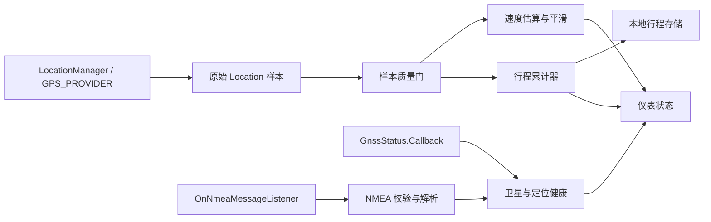

# CarGPS Android 技术设计

作者：long

验证日期：2026-08-05

目标运行环境：Android 8.1 / API 27

## 1. 技术边界

采用原生 Android 多模块工程，以 Kotlin 和 Jetpack Compose 实现竖屏手机仪表。拆分时保留系统 `LocationManager` 定位路径和离线能力，不依赖 Fused Location Provider，也不把网络作为定位或界面的前置条件。

拆分基线暂时保留 `minSdk = 27`、`compileSdk = 34` 和 `targetSdk = 34`，确保迁移不改变现有行为。后续手机版可以独立提高 SDK、依赖版本和性能策略；在最低版本正式调整前，运行路径仍不能把 API 30 才加入的重载直接调用在 API 27 上。

## 2. 数据流

关键原则：只有“有效定位样本”能驱动行程累计；NMEA 和卫星回调补充诊断信息，但不能绕过质量门直接修改里程。

## 3. API 27 实现方式

- 位置更新：`LocationManager.requestLocationUpdates(LocationManager.GPS_PROVIDER, ...)`。
- NMEA：使用 API 24 已提供的 `addNmeaListener(OnNmeaMessageListener, Handler)`，不要使用 API 30 才加入的 `Executor` 重载。
- 卫星状态：使用 `registerGnssStatusCallback(GnssStatus.Callback, Handler)`，不要继续使用 API 24 已废弃的 `GpsStatus.Listener`。
- 权限：NMEA 与 GNSS 详细状态需要 `android.permission.ACCESS_FINE_LOCATION`；运行时授权失败时进入“未授权”状态。
- 数据字段：在读取速度、海拔、方向和精度前分别检查 `hasSpeed()`、`hasAltitude()`、`hasBearing()` 和 `hasAccuracy()`，缺失值保持为空。

## 4. 数据优先级

| 指标 | 主来源 | 备用/诊断来源 | 说明 |
| --- | --- | --- | --- |
| 坐标 | `Location` | GGA/RMC | 所有统计只认通过质量门的 `Location` |
| 瞬时速度 | `Location.getSpeed()` | 相邻点推导、RMC/VTG | RMC/VTG 用于诊断差异，不独立累计 |
| 海拔 | `Location.getAltitude()` | GGA | 海拔缺失时不显示 `0 m` |
| 航向 | `Location.getBearing()` | RMC/VTG | 低速时航向可能不稳定 |
| 时间 | `Location.getTime()` | RMC/ZDA | 界面转换为本地时区，原始值保留 UTC 语义 |
| 卫星 | `GnssStatus` | GSA/GSV | 分开显示可见数和参与定位数 |
| 精度因子 | NMEA GSA/GGA | 无 | 设备未输出时显示“未提供” |

## 5. 工程与模块边界

- `gps-core`：注册和注销系统位置、NMEA、GNSS 状态监听，并承载质量门、速度估算和行程统计；不包含手机界面。
- `mobile-app`：包名 `com.cargps.mobile`，只负责竖屏手机界面、权限入口和 Activity 生命周期。
- `nmea-parser`：位于 `gps-core`，处理校验和、字段解析和语句容错，不维护行程状态。
- `location-quality`：位于 `gps-core`，判断样本是否可显示、是否可累计、是否发生过期或断点。
- `speed-estimator`：位于 `gps-core`，处理速度来源选择、单位转换、异常值过滤和平滑。
- `trip-domain`：位于 `gps-core`，处理活动行程状态机、距离和时间统计，不直接依赖 Android UI。
- `trip-storage`：活动行程快照、已结束行程与轨迹点的本地持久化。
- `dashboard-ui`：手机界面只消费 `gps-core` 提供的只读仪表状态，不自行计算业务统计。

业务规则应写在对应模块实现附近。例如，“定位恢复后不连接失锁前后的两个点”应贴近行程累计器的断点处理代码，而不是只保留在类头说明中。代码注释作者统一为 `long`，关键注释说明业务原因和错误结果，不复述语句动作。

## 6. 前后台策略

- 只在界面可见时记录：普通前台定位即可，权限和系统负担最小。
- 用户明确开始行程且允许切到其他应用继续记录：Android 8.0 起后台定位会被限频，应使用带常驻通知的前台服务保存连续行程。
- API 27 不需要 `ACCESS_BACKGROUND_LOCATION`，该权限从 API 29 才出现；但仍需遵守前台服务和通知要求。
- 首版可以把“仅前台记录”设为 MVP 边界，把前台服务作为第二个垂直切片，避免一开始混入服务恢复和通知生命周期。

## 7. 持久化建议

- 当前使用 API 27 原生 `SQLiteOpenHelper`，由 `TripStorage` 隔离存储实现；领域与 UI 不依赖 SQLite 类型。
- SQLite 写入统一进入单线程后台队列；读取作为队列屏障等待此前写入完成，避免 GPS 主线程回调直接执行磁盘操作并保证业务顺序。
- 活动行程元数据在开始、暂停和恢复时立即更新，每个有效行程点增量写入，避免重复序列化完整轨迹。
- 结束行程在同一事务中先写入已结束统计并迁移活动轨迹点，再清除活动行程；中途失败时优先保留完整可恢复数据。
- 进程重建时恢复行程模式、开始时间、暂停累计和轨迹点，并主动断开恢复前后的定位点，避免补算跨进程位移。
- 原始 NMEA 默认不持久化；后续导出能力与轨迹历史继续使用独立存储边界。

## 8. 测试重点

- NMEA：合法校验和、错误校验和、缺字段、多星座 talker ID、未知语句、非数值字段。
- 质量门：时间倒退、重复时间、低精度、超时恢复、跳点、静止漂移。
- 统计：移动/停车边界、暂停、恢复、结束、进程重建和零时长除法。
- UI：无权限、无数据、缺海拔、弱定位、过期、超长坐标文本，以及 `Pixel_9` 竖屏安全区和单屏无滚动约束。
- 设备：安装、UI 和功能验证显式指定 `Pixel_9`，不操作 Redmi 真机；任何安装命令都不能依赖 adb 默认设备。

## 9. 已验证的官方依据

- [`OnNmeaMessageListener`](https://developer.android.com/reference/android/location/OnNmeaMessageListener)：API 24 加入，用于接收 GNSS NMEA 语句。
- [`LocationManager`](https://developer.android.com/reference/android/location/LocationManager)：位置 API 权限、NMEA 监听和 GNSS 状态回调定义。
- [`Location`](https://developer.android.com/reference/android/location/Location)：位置对象包含坐标、时间、精度，以及可选的方向、海拔和速度。
- [后台定位](https://developer.android.com/develop/sensors-and-location/location/background)：Android 8.0 及以上后台应用的位置更新会被限制为每小时少量次数。

以上为 2026-08-05 抓取 Android Developers 页面后确认的结论。不同手机 GNSS 驱动是否实际输出全部 NMEA 语句，仍需在目标设备上验证。
